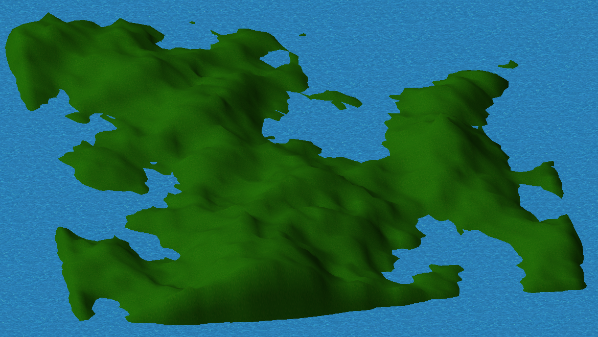

# random-terrain-generator
A random terrain generator which uses an implementation of the diamond square algorithm, it generates a 3d mesh which is converted into an OBJ format. A bitmap of the heightmap is also created in the same directory (This feature requires PIL).  

